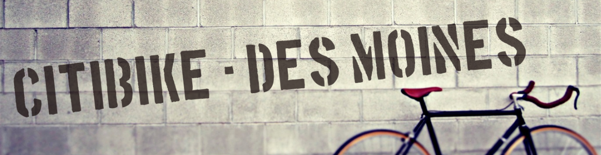
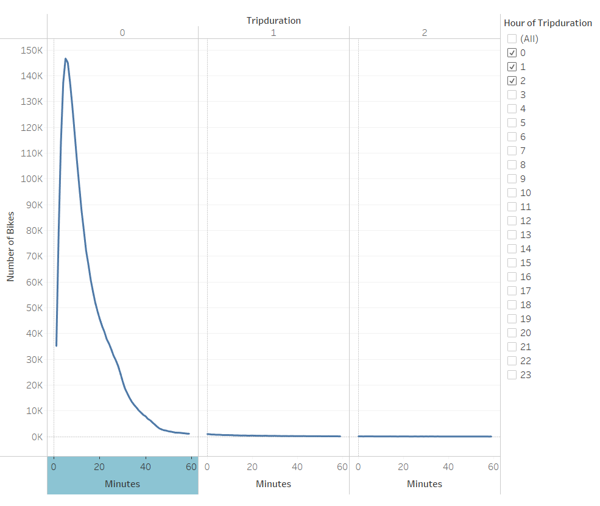
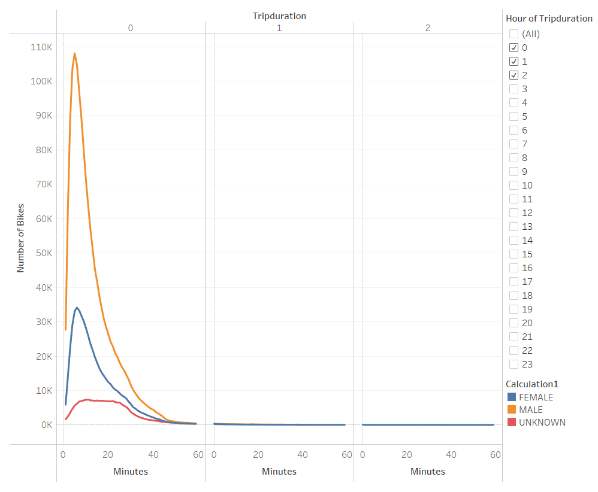
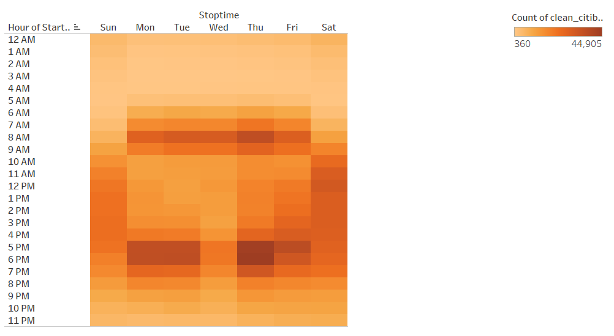
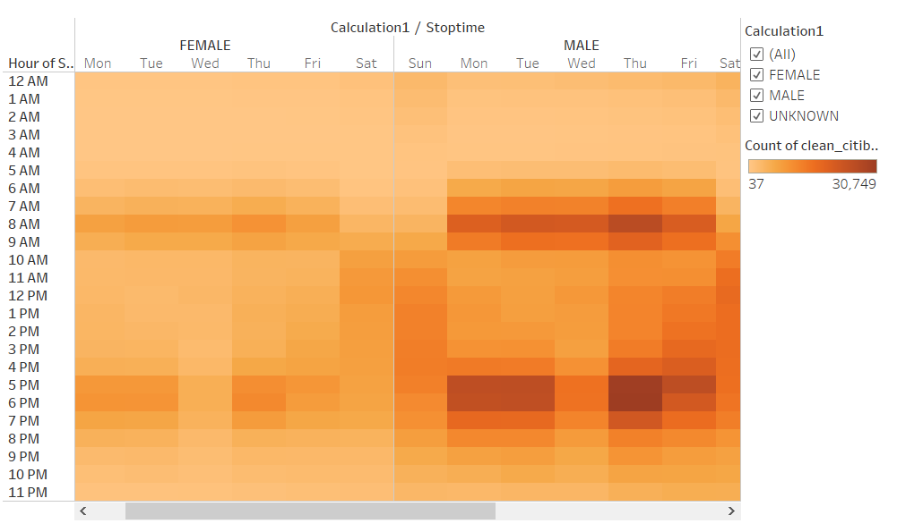
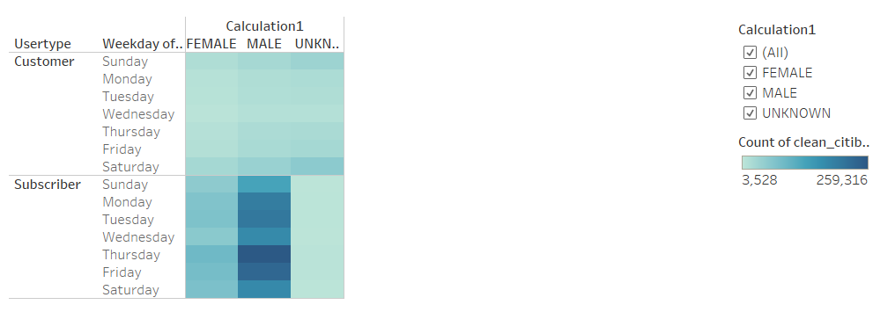
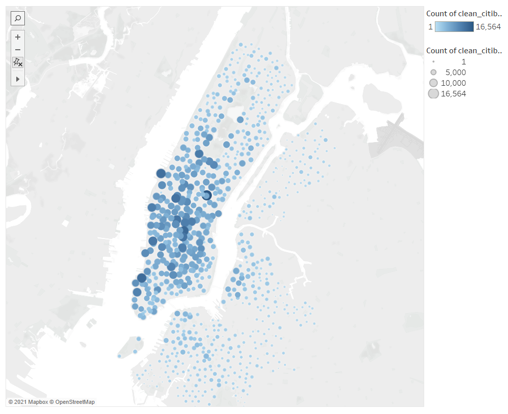
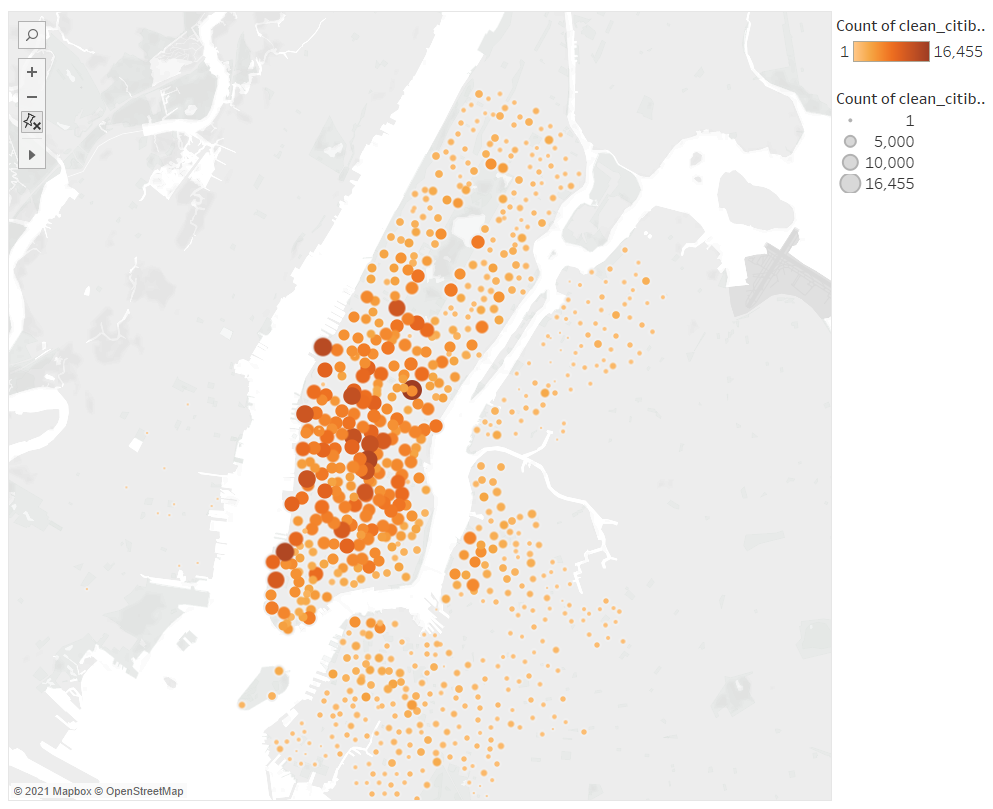

## Overview
___

After looking through recent vacation photos of a trip to New York City, I noticed an unlikely commonality amongst my favorite memories was the rental bikes that we used while traveling the city. The idea forms the possibility of bringing this bike rental business to my home town of Des Moines, IA and a few weeks later I have a planned meeting with potential investors. In preparation for this meeting, I've  created a presentation to highlight the successes of this business in NYC to show to my new potential investors.

[Click Here](https://public.tableau.com/app/profile/austen.marden/viz/NYC_Citibike_16378026055390/NYCCitiBike?publish=yes) to view the presentation material.

### Tools needed for this project:

    - Python
        - Jupyter Notebook
        - Pandas
    - Tableau

## Breakdown of NYC Citibike Analysis
---

### Checkout Times by User

    Overall users peak at a 5 minute ride duration, with a total of 146,752 rides in the month of august totalling 5 minutes.

    Breaking down the previous slide by gender, we can establish that a much higher frequency of male clients use CitiBike for their commute.

 

    By filtering our August data by day and hour, we can see that the peak usage times are at 8AM and between 5PM and 7PM during weekdays with average usage on Saturdays between 10AM and 6PM.

    Similar to the previous slide on CitiBike usage per gender, here we can see that males are the primary consumer of the CitiBike services throughout the week.

    Here we can see that the majority of CitiBike users on subscribers, with the assumption that they are local who use the service enough to warrant a subscription for frequent use.

    Primary starting points for Citibike users is the southern part of Manhattan.

    Primary ending points for Citibike users is also the southern part of Manhattan.

## Summary of Analysis
---

In summary, the CitiBike program has been quite successful in such a large city. Unfortunately, the population of Des Moines, IA is only a fraction of the population in NYC. In order to better correlate  the two locations, I would recommend further exploration around compcomparative aritive population density between Des Moines and NYC as well as typical traffic patterns to identify if there would be a similar interest in the CitiBike program compared to other modes of transportation for daily commuters. 
